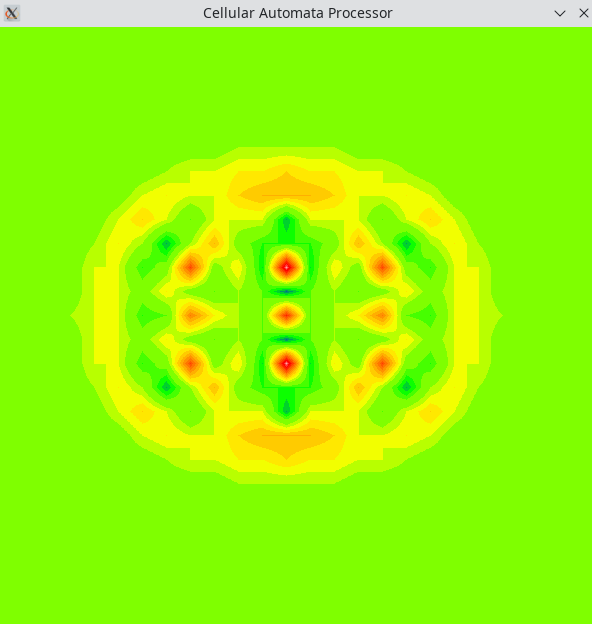
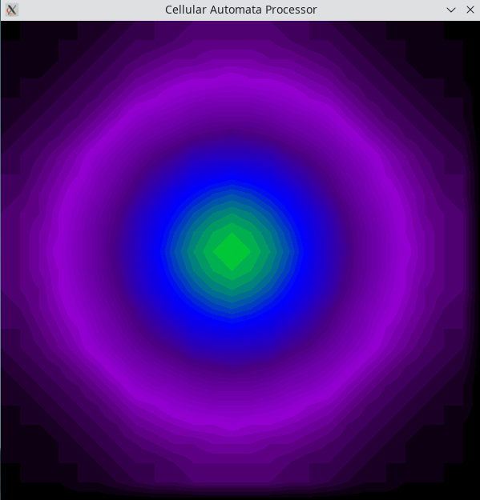

# Cellular Automaton Processor

The Cellular Automaton Processor is a very simple application-specific processor designed for tasks that can be modelled as cellular automata. It consists of a large number of cores that can only interact with their immediate neighbors. The capabilities of individual cores are limited to simple math and logic operations. Even though cellular automata can be Turing-complete, the processor is not intended to be used for general purpose computation. It is suitable for numerical solution of partial differential equations and various cellular automaton based programs.

## Examples

<br>
Two-dimensional wave equation solution. <br><br>The simulation starts with two close wave sources that produce interfering waves. 32 bits was the minimum register length that can produce numerically stable results (with 16 bits for the integer part and 16 bits for fractional part). Timestep was choosen to be 1/128.

<br>
Two-dimensional heat equation solution. <br><br>Initially, there was a circle with high temperature surrounded by a very cold environment. The screenshot was taken a few seconds after the beginning. It is possible to run the simulation with a register size of 16 bits with 8 bits for the fractional part. Even 12 bits registers can produce reasonable looking results, but it becomes inaccurate after a few minutes. </p>

<br>
Glider pattern in Conway's Game of Life. The space is a toroidal array, so the pattern repeats itself forever.

This is the simplest example and can be run with 6 bit registers in a 25x25 grid. It also works with 4 bit registers if the grid size is reduced to 8x8. This is currently the only one that is tested on an actual FPGA (Basys3 with F4PGA). The total number of cores in the simulations are 25x25=625.

The above screenshots are taken from Verilator simulations. The assembly language sources of the example programs can be found in the examples directory. C++ and Verilog sources for the simulations are available under targets/verilator. 

## Running Examples

A C++ compiler, Python 3 and Verilator are needed.

To compile Verilator simulation:

```
make simulation
```

To run examples:

```
./obj_dir/Vtop game-of-life
./obj_dir/Vtop wave-equation
./obj_dir/Vtop heat-equation
./obj_dir/Vtop recursion
```

## Instruction Format (16 Bits)
### R-Type

| Opcode | Target Register | First Register | Second Register |
|--------|-----------------|----------------|-----------------|
| 4 Bits | 4 Bits          | 4 Bits         | 4 Bits          |


### I-Type

| Opcode | Target Register | Immediate      |
|--------|-----------------|----------------|
| 4 Bits | 4 Bits          | 8 Bits         |

### B-Type

| Opcode | Condition Register | Relative Branch Address (Word) |
|--------|--------------------|--------------------------------|
| 4 Bits | 4 Bits             | 8 Bits                         |

### J-Type

| Opcode | Jump Address (Word) |
|--------|---------------------|
| 4 Bits | 12 Bits             |

### E-Type

| Opcode | Function Code | First Register | Second Register |
|--------|---------------|----------------|-----------------|
| 4 Bits | 4 Bits        | 4 Bits         | 4 Bits          |

## Registers

| Value | Name | Description                                         |
|-------|------|-----------------------------------------------------|
| 0     | rs   |Neighbor cores can read this through x-, x+, y-, y+  |
| 1     | r1   |General purpose register                             |
| 2     | r2   |General purpose register                             |
| 3     | r3   |General purpose register                             |
| 4     | r4   |General purpose register                             |
| 5     | r5   |General purpose register                             |
| 6     | r6   |General purpose register                             |
| 7     | r7   |General purpose register                             |
| 8     | r8   |General purpose register                             |

<br> These are general purpose registers often used for math and logic operations.

| Value | Name | Description                     |
|-------|------|---------------------------------|
| 9     | zero | Reading always yields zero      |
| 10    | x    | x coordinate of the core itself |
| 11    | y    | y coordinate of the core itself |
| 12    | x-   | State of the core on the left   |
| 13    | x+   | State of the core on the right  |
| 14    | y-   | State of the core below         |
| 15    | y+   | State of the core above         |

<br> The registers in the second table behave differently from the previous ones. The registers 'zero', 'x', 'y', 'x-', 'x+', 'y-' and 'y+' are read-only, and trying to write to them is undefined behavior.

| Value | Name      | Description                     |
|-------|-----------|---------------------------------|
| 9     | video     | Reading always yields zero      |
| 10    | precision | x coordinate of the core itself |

<br> The registers 'video' and 'precision' are write-only, and trying to read their existing values is undefined behavior.

Writing to the 'video' register displays the given value at the x and y coordinates of the core.

Writing to the 'precision' register sets the number of bits used for storing fractional part of real numbers in the fixed point format. The instructions that operate on fixed point numbers (fmul, fix, unfix) use this internally stored register in computations.

## Design

There is a single address bus and a single data bus for the instruction memory, so only one instruction can be fetched in a single cycle. To provide parallel execution ability, all cores must execute the same instruction at the same time. This is similar to GPUs, but the entire grid of cores behaves as a single warp/wavefront. No actual branching is possible at all. To provide branch ability when it is absolutely needed, both if and else portions of conditional statements are executed, and some cores stay inactivated, which leads to performance loss. In short, conditional branches that depend on cell indices should be avoided whenever possible, but they are still supported. However, there is no branch penalty when all cores follow the same path since there is no pipelining. 

Random access data memory does not exist. The entire data memory is limited to the registers in the cores, and a core can only access its own registers and the shared registers of its immediate neighbors in a single cycle. If a particular core needs more memory, it is possible to access registers of the distant cores in multiple cycles. The cost of accessing memory increases linearly with distance. However, this method also keeps the processor busy with shifting grid contents rather than doing computation. Adding a large data RAM to the design is still not preferred as it would be more like a GPU rather than a cellular automaton processor.

A small call stack memory is present in the global control unit. This allows programs to use function calls and recursion when needed. The current maximum recursion depth is 32 calls. Programs cannot directly read or write to this stack memory through the ISA. It cannot be used to store function arguments or local varibles. 

The grid of cores is a toroidal array (for example, the leftmost cores read the rightmost cores' values when they access x-). This is useful for two reasons: First, the example programs (especially PDEs) can work with this arrangement without any special care for boundaries, which would otherwise require linear extrapolation and branch divergence. Second, it is possible to use the processor for computing a 1D grid with this design. The only operation needed is to shift the grid down once, and then access x- in the first cell of each row. This yields the last value of the above row, connecting all rows in a one-dimensional way.

## Instruction Set Architecture

There are currently 17 instructions. The maximum number of different opcodes is limited to 16, so the last opcode value 15 is used for using extension instructions (E-type) together with the function code.

| Opcode | Mnemonic | Name                  | Type | Example          |
|--------|----------|-----------------------|------|------------------|
| 0      | li       | Load Immediate        |  I   | li r1,100        | 
| 1      | unl      | Unless                |  B   | unl r1,elseLabel |
| 2      | add      | Add                   |  R   | add r1,r2,r3     |
| 3      | sub      | Subtract              |  R   | sub r1,r2,r3     |
| 4      | and      | Logical AND           |  R   | and r1,r2,r3     |
| 5      | or       | Logical OR            |  R   | or r1,r2,r3      |
| 6      | nor      | Logical NOR           |  R   | nor r1,r2,r3     |
| 7      | seq      | Set if equal          |  R   | seq r1,r2,zero   |
| 8      | slt      | Set if less than      |  R   | slt r1,r2,r3     |
| 9      | mul      | Multiply              |  R   | mul r1,r1,r2     |
| 10     | shr      | Arithmetic Right Shift|  R   | shr r1,r1,r2     |
| 11     | fmul     | Fixed point multiply  |  R   | fmul r1,r2,r3    |
| 12     | j        | Jump                  |  J   | j label          |
| 13     | call     | Function call         |  J   | call func        |
| 14     | ret      | Function return       |  J   | ret 0            |
| 15     | -        | Extension             |  E   | -                |

### Extension Instructions

| Function Code | Mnemonic | Name                              | Example           |
|---------------|----------|-----------------------------------|-------------------|
| 0             | fix      | Convert decimal to fixed point    | fix r1,r2         |
| 1             | unfix    | Convert fixed point to decimal    | unfix r1,r2       |

Most instructions are trivial. There are four instructions that require some explanation.

The 'unl' (unless) instruction is used for conditional branches. It is a B-type instruction that jumps to the given label if the condition register is zero. It is intended to be used for implementing if statements in high level languages. For example the following code

```
video[threadIdx.y][threadIdx.x] = 0;

int cond1 = (threadIdx.x == 3);
int cond2 = (threadIdx.y == 4);
int condition = cond1 && cond2;
if (condition) {
  video[threadIdx.y][threadIdx.x] = 100;
}
```

would be compiled into

```
li video,0       # video[threadIdx.y][threadIdx.x] = 0;

li r1,3
seq r1,x,r1      # int cond1 = (threadIdx.x == 3);

li r2,4 
seq r2,y,r2      # int cond2 = (threadIdx.y == 4);

and r1,r1,r2     # int condition = cond1 && cond2;
unl r1,else      # if (condition) {
  li video,100   #   video[threadIdx.y][threadIdx.x] = 100;
else:            # }
```

Since r1 is true only for the core (x=3, y=4), all other cores are going to wait until it executes the instruction in the if body. Then the cores will continue executing rest of the instructions in the program. If r1 was false for all cores, no wait would occur, and the program execution would directly continue at 'else' label.

The 'fmul' instruction interprets values given in the source registers as fixed point numbers, multiplies them and writes the product to the target register in the same fixed point format. It respects the value of the internal 'precision' register which determines the number of bits used for the fractional part.

The 'fix' instructions converts the integer value given in the second register to a fixed point value and writes the result to the first register. It uses the value of the internal 'precision' register.

The 'unfix' instructon converts the fixed point value in the second register to an integer value and write the result to the first register. The fractional part is lost, so executing 'fix' after 'unfix' may not produce the same result. This instruction also uses the value of the internal 'precision' register.

## LICENSE

The assembler source and example programs are released under GNU General Public License v3.0 or any later version.

The HDL and C++ sources are released under the Strongly Reciprocal CERN Open Hardware License Version 2 (CERN-OHL-S-2.0).
