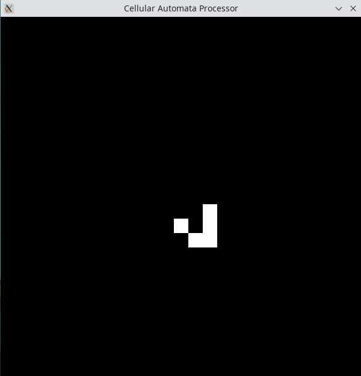

# Cellular Automaton Processor

The Cellular Automaton Processor is a very simple application-specific processor designed for tasks that can be modelled as cellular automata. It consists of a large number of cores that can only interact with their immediate neighbors. The capabilities of individual cores are limited to simple math and logic operations. Even though cellular automata can be Turing-complete, the processor is not intended to be used for general purpose computation. It is suitable for numerical solution of partial differential equations and various cellular automaton based programs.

## Examples

<br>
Two-dimensional wave equation solution. The simulation starts with two close wave sources that produce interfering waves.

<br>
Two-dimensional heat equation solution. Initially, there was a circle with high temperature surrounded by a very cold environment. The screenshot was taken a few seconds after the beginning.</p>

<br>
Glider pattern in Conway's Game of Life. The space is a toroidal array, so the pattern repeats itself forever.

The above screenshots are taken from Verilator simulations. Assembly language sources can be found in examples directory. C++ and Verilog sources for the Verilator are available under targets/verilator. The total number of cores in the simulations are 25x25=625. Register lengths need to be at least 32 bits for the PDE examples to run, but the Game of Life example can run even with 4 bits.

## Running Examples

A C++ compiler and Verilator are needed.

To compile Verilator simulation:

```
make simulation
```

To run examples:

```
./obj_dir/Vtop game-of-life
./obj_dir/Vtop wave-equation
./obj_dir/Vtop heat-equation
```

## Instruction Format (16 Bits)
### R-Type

| Opcode | Target Register | First Register | Second Register |
|--------|-----------------|----------------|-----------------|
| 4 Bits | 4 Bits          | 4 Bits         | 4 Bits          |


### I-Type

| Opcode | Target Register | Immediate      |
|--------|-----------------|----------------|
| 4 Bits | 4 Bits          | 8 Bits         |

### J-Type

| Opcode | Jump Address                     |
|--------|----------------------------------|
| 4 Bits | 12 Bits                          |

## Registers

| Value | Name | Description                                         |
|-------|------|-----------------------------------------------------|
| 0     | my   |Neighbor cores can read this through x-, x+, y-, y+  |
| 1     | r1   |General purpose register                             |
| 2     | r2   |General purpose register                             |
| 3     | r3   |General purpose register                             |
| 4     | r4   |General purpose register                             |
| 5     | r5   |General purpose register                             |
| 6     | r6   |General purpose register                             |
| 7     | r7   |General purpose register                             |
| 8     | r8   |General purpose register                             |

<br>

| Value | Name | Alternative Name | Description                     |
|-------|------|------------------|---------------------------------|
| 9     | zero | video            | Explained below                 |
| 10    | x    | -                | x coordinate of the core itself |
| 11    | y    | -                | y coordinate of the core itself |
| 12    | x-   | -                | State of the core on the left   |
| 13    | x+   | -                | State of the core on the right  |
| 14    | y-   | -                | State of the core below         |
| 15    | y+   | -                | State of the core above         |

<br> The registers in the second table behave differently from the registers in the first table. The ones with values 10-15 are read-only, and trying to write to these registers leads to undefined behavior. (Actually, what currently happens is that the general purpose registers get overwritten, but they may have special purposes as target registers in the future.)

The zero register is the only register with such a special purpose. Reading it always yields the constant value zero. However, writing to it copies the given value to the video memory associated with the core, and this feature is used to display computation results.

## Design

There is a single address bus and a single data bus for the instruction memory, so only one instruction can be fetched in a single cycle. To provide parallel execution ability, all cores must execute the same instruction at the same time. This is similar to GPUs, but the entire grid of cores behaves as a single warp/wavefront. No actual branching is possible at all. To provide branch ability when it is absolutely needed, both if and else portions of conditional statements are executed, and some cores stay inactivated, which leads to performance loss. In short, conditional branches that depend on cell indices should be avoided whenever possible, but they are still supported. However, there is no branch penalty when all cores follow the same path since there is no pipelining. 

Random access data memory does not exist. The entire data memory is limited to the registers in the cores, and a core can only access its own registers and the shared registers of its immediate neighbors in a single cycle. If a particular core needs more memory, it is possible to access registers of the distant cores in multiple cycles. The cost of accessing memory increases linearly with distance. However, this method also keeps the processor busy with shifting grid contents rather than doing computation. Adding a large data RAM to the design is still not preferred as it would be more like a GPU rather than a cellular automaton processor.

A small call stack memory is present in the global control unit. This allows programs to use function calls and recursion when needed. The current maximum recursion depth is 32 calls. Programs cannot directly read or write to this stack memory through the ISA. It cannot be used to store function arguments or local varibles. 

The grid of cores is a toroidal array (for example, the leftmost cores read the rightmost cores' values when they access x-). This is useful for two reasons: First, the example programs (especially PDEs) can work with this arrangement without any special care for boundaries, which would otherwise require linear extrapolation and branch divergence. Second, it is possible to use the processor for computing a 1D grid with this design. The only operation needed is to shift the grid down once, and then access x- in the first cell of each row. This yields the last value of the above row, connecting all rows in a one-dimensional way.

## Instruction Set Architecture

There are currently 15 instructions. The maximum number of different opcodes is limited to 16, so the last opcode value 15 will be used for enabling less commonly used extension instructions with additional parameters.

| Opcode | Mnemonic | Name                  | Type | Example          |
|--------|----------|-----------------------|------|------------------|
| 0      | li       | Load Immediate        |  I   | li r1,100        | 
| 1      | unl      | Unless                |  I   | unl r1,elseLabel |
| 2      | add      | Add                   |  R   | add r1,r2,r3     |
| 3      | sub      | Subtract              |  R   | sub r1,r2,r3     |
| 4      | and      | Logical AND           |  R   | and r1,r2,r3     |
| 5      | or       | Logical OR            |  R   | or r1,r2,r3      |
| 6      | nor      | Logical NOR           |  R   | nor r1,r2,r3     |
| 7      | seq      | Set if equal          |  R   | seq r1,r2,zero   |
| 8      | slt      | Set if less than      |  R   | slt r1,r2,r3     |
| 9      | mul      | Multiply              |  R   | mul r1,r1,r2     |
| 10     | shr      | Arithmetic Right Shift|  R   | shr r1,r1,r2     |
| 11     | fmul     | Fixed point multiply  |  R   | fmul r1,r2,r3    |
| 12     | j        | Jump                  |  J   | j label          |
| 13     | call     | Function call         |  J   | call func        |
| 14     | ret      | Function return       |  J   | ret 0            |
| 15     | -        | Reserved              |  -   | -                |

Most instructions are trivial. There are two instructions that require a little explanation.

The 'unl' (unless) instruction is used for conditional branches. It is an I-type instruction that reads the value of the given register and jumps to the given label if the register is zero. It is intended to be used for implementing if statements in high level languages. For example the following code

```
video[threadIdx.y][threadIdx.x] = 0;

int cond1 = (threadIdx.x == 3);
int cond2 = (threadIdx.y == 4);
int condition = cond1 && cond2;
if (condition) {
  video[threadIdx.y][threadIdx.x] = 100;
}
```

would be compiled into

```
li video,0       # video[threadIdx.y][threadIdx.x] = 0;

li r1,3
seq r1,x,r1      # int cond1 = (threadIdx.x == 3);

li r2,4 
seq r2,y,r2      # int cond2 = (threadIdx.y == 4);

and r1,r1,r2     # int condition = cond1 && cond2;
unl r1,else      # if (condition) {
  li video,100   #   video[threadIdx.y][threadIdx.x] = 100;
else:            # }
```

Since r1 is true only for the core (x=3,y=4), all other cores are going to wait until it executes the instruction in the if body. Then the cores will continue executing rest of the instructions in the program. If r1 was false for all cores, no wait would occur, and the program execution would directly continue at 'else' label.

The 'fmul' instruction multiplies given two registers and internally stores the result in a register that is twice as large as input registers. Then it writes the middle portion of the result to the target register. This means that if input registers store 32 bit fixed point values where the high 16 bits store the integer part and low 16 bits store the fractional part, the target register contains the multiplication result in the same format after executing the instruction.

## LICENSE

The assembler source and examples are released under GNU General Public License v3.0 or any later version.

The HDL sources are released under the Strongly Reciprocal CERN Open Hardware License Version 2 (CERN-OHL-S-2.0).

The C++ sources associated with the Verilator simulation of the processor are licensed under the Strongly Reciprocal CERN Open Hardware License Version 2 (CERN-OHL-S-2.0).
